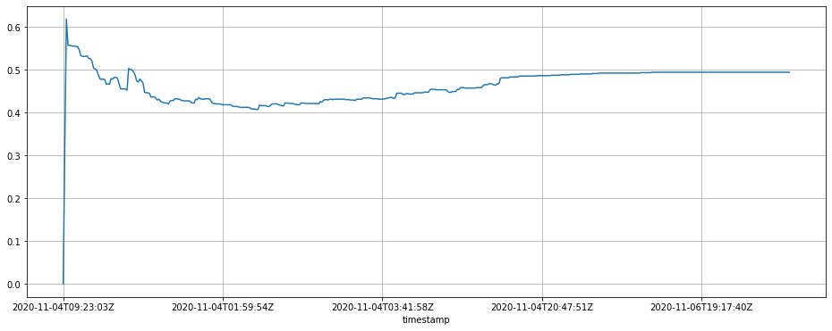

Easy access to (US 2020, for now) election statistics.

# How to use


```python
import pandas as pd
from elections import President2020TimeSeries, Races2020, Election2020RawJson

```

## President's race stats


```python
s = President2020TimeSeries()
len(s)
```


    51


`s` is a dictionary-like interface to the presidential race. 

It's keys are the states


```python
print(*s)
```

    alabama alaska arizona arkansas california colorado connecticut delaware district-of-columbia florida georgia hawaii idaho illinois indiana iowa kansas kentucky louisiana maine maryland massachusetts michigan minnesota mississippi missouri montana nebraska nevada new-hampshire new-jersey new-mexico new-york north-carolina north-dakota ohio oklahoma oregon pennsylvania rhode-island south-carolina south-dakota tennessee texas utah vermont virginia washington west-virginia wisconsin wyoming


It's values are dataframes containing the stats.


```python
state = 'georgia'
df = s[state]
df
```


<div>
<style scoped>
    .dataframe tbody tr th:only-of-type {
        vertical-align: middle;
    }

    .dataframe tbody tr th {
        vertical-align: top;
    }

    .dataframe thead th {
        text-align: right;
    }
</style>
<table border="1" class="dataframe">
  <thead>
    <tr style="text-align: right;">
      <th></th>
      <th>votes</th>
      <th>eevp</th>
      <th>eevp_source</th>
      <th>trumpd</th>
      <th>bidenj</th>
    </tr>
    <tr>
      <th>timestamp</th>
      <th></th>
      <th></th>
      <th></th>
      <th></th>
      <th></th>
    </tr>
  </thead>
  <tbody>
    <tr>
      <th>2020-11-04T09:23:03Z</th>
      <td>0</td>
      <td>0</td>
      <td>edison</td>
      <td>0.000</td>
      <td>0.000</td>
    </tr>
    <tr>
      <th>2020-11-04T00:14:11Z</th>
      <td>408</td>
      <td>0</td>
      <td>edison</td>
      <td>0.674</td>
      <td>0.326</td>
    </tr>
    <tr>
      <th>2020-11-04T00:15:51Z</th>
      <td>127106</td>
      <td>2</td>
      <td>edison</td>
      <td>0.370</td>
      <td>0.618</td>
    </tr>
    <tr>
      <th>2020-11-04T00:19:55Z</th>
      <td>173638</td>
      <td>3</td>
      <td>edison</td>
      <td>0.431</td>
      <td>0.557</td>
    </tr>
    <tr>
      <th>2020-11-04T00:21:57Z</th>
      <td>174006</td>
      <td>3</td>
      <td>edison</td>
      <td>0.432</td>
      <td>0.557</td>
    </tr>
    <tr>
      <th>...</th>
      <td>...</td>
      <td>...</td>
      <td>...</td>
      <td>...</td>
      <td>...</td>
    </tr>
    <tr>
      <th>2020-11-06T23:14:40Z</th>
      <td>4969860</td>
      <td>99</td>
      <td>edison</td>
      <td>0.493</td>
      <td>0.494</td>
    </tr>
    <tr>
      <th>2020-11-06T23:17:43Z</th>
      <td>4969869</td>
      <td>99</td>
      <td>edison</td>
      <td>0.493</td>
      <td>0.494</td>
    </tr>
    <tr>
      <th>2020-11-06T23:36:39Z</th>
      <td>4969873</td>
      <td>99</td>
      <td>edison</td>
      <td>0.493</td>
      <td>0.494</td>
    </tr>
    <tr>
      <th>2020-11-06T23:41:44Z</th>
      <td>4969880</td>
      <td>99</td>
      <td>edison</td>
      <td>0.493</td>
      <td>0.494</td>
    </tr>
    <tr>
      <th>2020-11-06T23:45:40Z</th>
      <td>4970093</td>
      <td>99</td>
      <td>edison</td>
      <td>0.493</td>
      <td>0.494</td>
    </tr>
  </tbody>
</table>
<p>456 rows × 5 columns</p>
</div>


```python
df['bidenj'].plot(figsize=(16, 6), grid=True, title=state);
```


    

    


## Other races

But that's not the only race going on here. 


```python
s = Races2020()
len(s)
```


    51


```python
data = s['new-york']   # by the way, you can tab-complete this if you're working in a jupyter notebook
print(type(data))
print(f"{len(data)} items... Here are the first 5:")
list(data)[:5]
```

    <class 'py2store.base.Store'>
    242 items... Here are the first 5:


    ['president-general-2020-11-03',
     'house-general-district-001-2020-11-03',
     'house-general-district-002-2020-11-03',
     'house-general-district-003-2020-11-03',
     'house-general-district-004-2020-11-03']


So we see that now, instead of just getting the president's race, we get... 242 races (one of which is the president's race). 

What you need to know, as well, is that `President2020TimeSeries` just gave you one of the many datas available for the race (the 'timeseries' one), extracted and formated for your convenience, since it's probably the main information you're here for. 

But there are other associated (raw) datas you may or may not be interested in. Here's what you got:


```python
data['president-general-2020-11-03'].keys()  # you can tab complete here as well (you're welcome!)
```


    dict_keys(['race_id', 'race_slug', 'url', 'state_page_url', 'ap_polls_page', 'edison_exit_polls_page', 'race_type', 'election_type', 'election_date', 'runoff', 'race_name', 'office', 'officeid', 'race_rating', 'seat', 'seat_name', 'state_id', 'state_slug', 'state_name', 'state_nyt_abbrev', 'state_shape', 'party_id', 'uncontested', 'report', 'result', 'result_source', 'gain', 'lost_seat', 'votes', 'electoral_votes', 'absentee_votes', 'absentee_counties', 'absentee_count_progress', 'absentee_outstanding', 'absentee_max_ballots', 'provisional_outstanding', 'provisional_count_progress', 'poll_display', 'poll_countdown_display', 'poll_waiting_display', 'poll_time', 'poll_time_short', 'precincts_reporting', 'precincts_total', 'reporting_display', 'reporting_value', 'eevp', 'tot_exp_vote', 'eevp_source', 'eevp_value', 'eevp_display', 'county_data_source', 'incumbent_party', 'no_forecast', 'last_updated', 'candidates', 'has_incumbent', 'leader_margin_value', 'leader_margin_votes', 'leader_margin_display', 'leader_margin_name_display', 'leader_party_id', 'counties', 'votes2016', 'margin2016', 'clinton2016', 'trump2016', 'votes2012', 'margin2012', 'expectations_text', 'expectations_text_short', 'absentee_ballot_deadline', 'absentee_postmark_deadline', 'update_sentences', 'race_diff', 'winnerCalledTimestamp', 'timeseries'])


```python
t = data['president-general-2020-11-03']
print(t['trump2016'], t['clinton2016'])
```

    2819534 4556124


## Election2020RawJson

But if you want even more, and even more raw than the above, we can give that to you. 

With `Election2020RawJson` you get access to the original full json. 


```python
raw_jsons = Election2020RawJson()
json_data = raw_jsons['california']
json_data.keys()
```


    dict_keys(['data', 'meta'])


```python
json_data['meta']
```


    {'version': 10403,
     'track': '2020-11-03',
     'timestamp': '2020-11-06T23:52:57.623Z'}


```python
json_data['data'].keys()
```


    dict_keys(['races', 'party_control', 'liveUpdates'])


```python
pd.DataFrame(json_data['data']['party_control']).set_index('race_type').T
```


<div>
<style scoped>
    .dataframe tbody tr th:only-of-type {
        vertical-align: middle;
    }

    .dataframe tbody tr th {
        vertical-align: top;
    }

    .dataframe thead th {
        text-align: right;
    }
</style>
<table border="1" class="dataframe">
  <thead>
    <tr style="text-align: right;">
      <th>race_type</th>
      <th>house</th>
      <th>president</th>
      <th>senate</th>
    </tr>
  </thead>
  <tbody>
    <tr>
      <th>state_id</th>
      <td></td>
      <td></td>
      <td></td>
    </tr>
    <tr>
      <th>needed_for_control</th>
      <td>218</td>
      <td>270</td>
      <td>50</td>
    </tr>
    <tr>
      <th>total</th>
      <td>435</td>
      <td>538</td>
      <td>100</td>
    </tr>
    <tr>
      <th>no_election</th>
      <td>{}</td>
      <td>{}</td>
      <td>{'democrat': 35, 'republican': 30, 'other': 0}</td>
    </tr>
    <tr>
      <th>winner</th>
      <td>False</td>
      <td>False</td>
      <td>False</td>
    </tr>
    <tr>
      <th>parties</th>
      <td>{'democrat': {'party_id': 'democrat', 'name_di...</td>
      <td>{'democrat': {'party_id': 'democrat', 'name_di...</td>
      <td>{'democrat': {'party_id': 'democrat', 'name_di...</td>
    </tr>
    <tr>
      <th>winnerCalledTimestamp</th>
      <td>None</td>
      <td>None</td>
      <td>None</td>
    </tr>
  </tbody>
</table>
</div>


```python
pd.DataFrame(json_data['data']['liveUpdates'])
```


<div>
<style scoped>
    .dataframe tbody tr th:only-of-type {
        vertical-align: middle;
    }

    .dataframe tbody tr th {
        vertical-align: top;
    }

    .dataframe thead th {
        text-align: right;
    }
</style>
<table border="1" class="dataframe">
  <thead>
    <tr style="text-align: right;">
      <th></th>
      <th>id</th>
      <th>author</th>
      <th>author_title_or_location</th>
      <th>text</th>
      <th>link_url</th>
      <th>link_text</th>
      <th>linked_state_1</th>
      <th>linked_state_2</th>
      <th>linked_state_3</th>
      <th>image_url</th>
      <th>...</th>
      <th>call_type</th>
      <th>race_id</th>
      <th>winner</th>
      <th>party_id</th>
      <th>candidate_last_name</th>
      <th>candidate_name_display</th>
      <th>candidate_id</th>
      <th>race_call_party_winner</th>
      <th>state_name</th>
      <th>link</th>
    </tr>
  </thead>
  <tbody>
    <tr>
      <th>0</th>
      <td>333</td>
      <td>Nate Cohn</td>
      <td>in New York</td>
      <td>New ballots from Clark County (that’s Las Vega...</td>
      <td></td>
      <td></td>
      <td>NV</td>
      <td></td>
      <td></td>
      <td></td>
      <td>...</td>
      <td>NaN</td>
      <td>NaN</td>
      <td>NaN</td>
      <td>NaN</td>
      <td>NaN</td>
      <td>NaN</td>
      <td>NaN</td>
      <td>NaN</td>
      <td>NaN</td>
      <td>NaN</td>
    </tr>
    <tr>
      <th>1</th>
      <td>332</td>
      <td>Nate Cohn</td>
      <td>in New York</td>
      <td>The latest Arizona ballot releases aren’t look...</td>
      <td></td>
      <td></td>
      <td>AZ</td>
      <td></td>
      <td></td>
      <td></td>
      <td>...</td>
      <td>NaN</td>
      <td>NaN</td>
      <td>NaN</td>
      <td>NaN</td>
      <td>NaN</td>
      <td>NaN</td>
      <td>NaN</td>
      <td>NaN</td>
      <td>NaN</td>
      <td>NaN</td>
    </tr>
    <tr>
      <th>2</th>
      <td>331</td>
      <td>Nick Corasaniti</td>
      <td>in Philadelphia</td>
      <td>There are still 102,000 mail ballots to be cou...</td>
      <td></td>
      <td></td>
      <td>PA</td>
      <td></td>
      <td></td>
      <td></td>
      <td>...</td>
      <td>NaN</td>
      <td>NaN</td>
      <td>NaN</td>
      <td>NaN</td>
      <td>NaN</td>
      <td>NaN</td>
      <td>NaN</td>
      <td>NaN</td>
      <td>NaN</td>
      <td>NaN</td>
    </tr>
    <tr>
      <th>3</th>
      <td>330</td>
      <td>Dave Philipps</td>
      <td>in Las Vegas</td>
      <td>Biden nets 2,520 votes in the Las Vegas area, ...</td>
      <td></td>
      <td></td>
      <td>NV</td>
      <td></td>
      <td></td>
      <td></td>
      <td>...</td>
      <td>NaN</td>
      <td>NaN</td>
      <td>NaN</td>
      <td>NaN</td>
      <td>NaN</td>
      <td>NaN</td>
      <td>NaN</td>
      <td>NaN</td>
      <td>NaN</td>
      <td>NaN</td>
    </tr>
    <tr>
      <th>4</th>
      <td>329</td>
      <td>Katie Glueck</td>
      <td>in Wilmington, Del.</td>
      <td>I’m told Biden spent the day watching election...</td>
      <td></td>
      <td></td>
      <td></td>
      <td></td>
      <td></td>
      <td></td>
      <td>...</td>
      <td>NaN</td>
      <td>NaN</td>
      <td>NaN</td>
      <td>NaN</td>
      <td>NaN</td>
      <td>NaN</td>
      <td>NaN</td>
      <td>NaN</td>
      <td>NaN</td>
      <td>NaN</td>
    </tr>
    <tr>
      <th>...</th>
      <td>...</td>
      <td>...</td>
      <td>...</td>
      <td>...</td>
      <td>...</td>
      <td>...</td>
      <td>...</td>
      <td>...</td>
      <td>...</td>
      <td>...</td>
      <td>...</td>
      <td>...</td>
      <td>...</td>
      <td>...</td>
      <td>...</td>
      <td>...</td>
      <td>...</td>
      <td>...</td>
      <td>...</td>
      <td>...</td>
      <td>...</td>
    </tr>
    <tr>
      <th>444</th>
      <td>5</td>
      <td>Nate Cohn</td>
      <td>in New York</td>
      <td>Tonight, the needle will be back — sort of. We...</td>
      <td>https://www.nytimes.com/2020/11/02/upshot/need...</td>
      <td>Learn more about the needle</td>
      <td></td>
      <td></td>
      <td></td>
      <td></td>
      <td>...</td>
      <td>NaN</td>
      <td>NaN</td>
      <td>NaN</td>
      <td>NaN</td>
      <td>NaN</td>
      <td>NaN</td>
      <td>NaN</td>
      <td>NaN</td>
      <td>NaN</td>
      <td>NaN</td>
    </tr>
    <tr>
      <th>445</th>
      <td>4</td>
      <td>Sheera Frenkel</td>
      <td>in Silicon Valley</td>
      <td>Times tech reporters will be monitoring for mi...</td>
      <td></td>
      <td></td>
      <td></td>
      <td></td>
      <td></td>
      <td></td>
      <td>...</td>
      <td>NaN</td>
      <td>NaN</td>
      <td>NaN</td>
      <td>NaN</td>
      <td>NaN</td>
      <td>NaN</td>
      <td>NaN</td>
      <td>NaN</td>
      <td>NaN</td>
      <td>NaN</td>
    </tr>
    <tr>
      <th>446</th>
      <td>3</td>
      <td>Michael Barbaro</td>
      <td>in New York</td>
      <td>From 4 p.m. to 8 p.m. Eastern time, we’ll be t...</td>
      <td>https://nytimes.com/thedaily</td>
      <td>Listen here</td>
      <td></td>
      <td></td>
      <td></td>
      <td></td>
      <td>...</td>
      <td>NaN</td>
      <td>NaN</td>
      <td>NaN</td>
      <td>NaN</td>
      <td>NaN</td>
      <td>NaN</td>
      <td>NaN</td>
      <td>NaN</td>
      <td>NaN</td>
      <td>NaN</td>
    </tr>
    <tr>
      <th>447</th>
      <td>2</td>
      <td>Trip Gabriel</td>
      <td>in Butler County, Pa.</td>
      <td>A look at Trump and the G.O.P.’s closing strat...</td>
      <td>https://www.nytimes.com/2020/11/02/us/politics...</td>
      <td></td>
      <td></td>
      <td></td>
      <td></td>
      <td></td>
      <td>...</td>
      <td>NaN</td>
      <td>NaN</td>
      <td>NaN</td>
      <td>NaN</td>
      <td>NaN</td>
      <td>NaN</td>
      <td>NaN</td>
      <td>NaN</td>
      <td>NaN</td>
      <td>NaN</td>
    </tr>
    <tr>
      <th>448</th>
      <td>1</td>
      <td>Shane Goldmacher</td>
      <td>in New Hope, Pa.</td>
      <td>Here’s our recap of the final day of campaigni...</td>
      <td>https://www.nytimes.com/2020/11/02/us/politics...</td>
      <td></td>
      <td></td>
      <td></td>
      <td></td>
      <td></td>
      <td>...</td>
      <td>NaN</td>
      <td>NaN</td>
      <td>NaN</td>
      <td>NaN</td>
      <td>NaN</td>
      <td>NaN</td>
      <td>NaN</td>
      <td>NaN</td>
      <td>NaN</td>
      <td>NaN</td>
    </tr>
  </tbody>
</table>
<p>449 rows × 31 columns</p>
</div>


```python

```


```python

```

